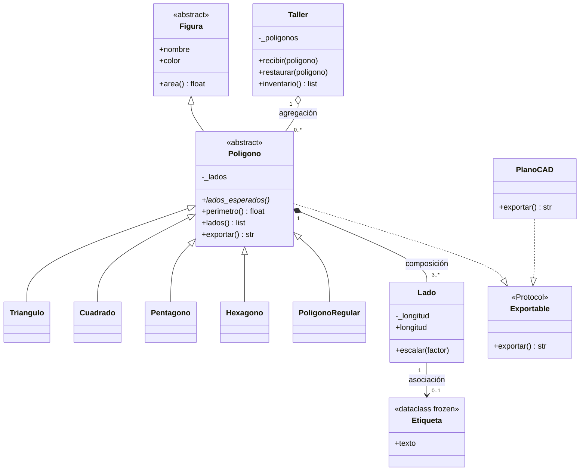

```mermaid
classDiagram
    class Exportable {
        <<Protocol>>
        +exportar() str
    }

    class Figura {
        <<abstract>>
        +nombre
        +color
        +area() float
    }

    class Poligono {
        <<abstract>>
        -_lados
        +lados_esperados()*
        +perimetro() float
        +lados() list
        +exportar() str
    }

    class Lado {
        -_longitud
        +longitud
        +escalar(factor)
    }

    class Etiqueta {
        <<dataclass frozen>>
        +texto
    }

    class Triangulo
    class Cuadrado
    class Pentagono
    class Hexagono
    class PoligonoRegular
    class Taller {
        -_poligonos
        +recibir(poligono)
        +restaurar(poligono)
        +inventario() list
    }

    class PlanoCAD {
        +exportar() str
    }

    Figura <|-- Poligono
    Poligono <|-- Triangulo
    Poligono <|-- Cuadrado
    Poligono <|-- Pentagono
    Poligono <|-- Hexagono
    Poligono <|-- PoligonoRegular

    Poligono "1" *-- "3..*" Lado : composición
    Lado "1" --> "0..1" Etiqueta : asociación
    Taller "1" o-- "0..*" Poligono : agregación

    Poligono ..|> Exportable
    PlanoCAD ..|> Exportable
```
